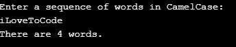

# CamelCase
A Go program to analyze the number of words in a CamelCase input string.
<h3>Problem from Hackerrank</h3>
Alice wrote a sequence of words in CamelCase as a string of letters, s, having the following properties:
<ul>
  <li>It is a concatenation of one or more words consisting of English letters.</li>
  <li>All letters in the first word are lowercase.</li>
  <li>For each of the subsequent words, the first letter is uppercase and rest of the letters are lowercase.</li>
</ul>
Given s, print the number of words in  on a new line.

For example, <i>s=oneTwoThree</i>. There are <i>3</i> words in the string.

### Test run

